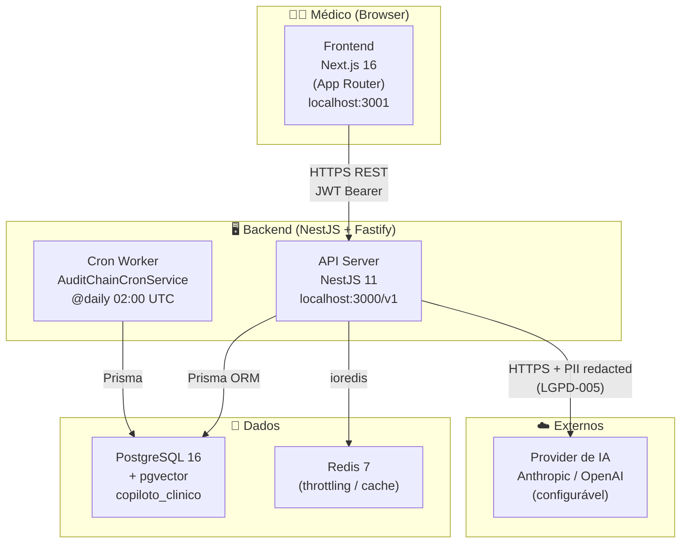

# Arquitetura — Copiloto Clínico

**Versão:** R0  
**Data:** 2026-06-05

---

## Diagrama C4 — Nível 2 (Containers)



---

## Mapa de Módulos

| Módulo | Responsabilidade | Principais entidades |
|---|---|---|
| `auth` | Registro, login, JWT, refresh tokens | Physician, RefreshToken |
| `ai-gateway` | Abstração de providers (Anthropic/OpenAI), embeddings, completions | — |
| `copilot` | Orquestrador clínico: PII mask → retrieval → prompt → LLM → validate | AiInteraction |
| `encounters` | CRUD de atendimentos médicos com validação de patientRef | Encounter |
| `documents` | Geração, edição e confirmação de documentos com gate auditável | Document |
| `audit` | Trilha append-only, verificação de cadeia, endpoint interno | AuditLog |
| `guidelines` | Ingestão e busca vetorial de diretrizes (pgvector) | GuidelineChunk |
| `lgpd` | Exportação e apagamento de dados (LGPD Art. 18) | Consent |
| `health` | Health check para load balancer | — |
| `workers` | Cron jobs cross-cutting (AuditChainCronService) | — |

---

## Fluxo Principal: Análise Clínica

```
Médico digita texto do caso
        ↓
[FE] POST /v1/encounters/:id/copilot/analyze
        ↓
[copilot/orchestrator]
  1. findById() → valida acesso + obtém patientRef
  2. maskPII(caseText) → remove CPF, telefone, email, RG, etc.
  3. redactPatientRef() → substitui patientRef por [PATIENT_REF_REDACTED]
  4. scanForInjection() → rejeita prompt injection
  5. retrieval.search() → busca chunks de diretrizes relevantes (pgvector)
  6. buildPrompt() → monta prompt com evidências e contexto
  7. aiGateway.complete() → envia ao provider (texto já redatado)
  8. validateOutput() → verifica schema, citações, uncertainty
  9. aiInteraction.create() → persiste inputRedacted + output
 10. encounters.update() → status = 'in_review'
        ↓
[FE] Exibe recomendações + banner de incerteza se uncertainty=true
```

---

## Fluxo: Confirmação de Documento

```
Médico revisa documento e clica "Confirmar"
        ↓
[FE] Exibe dialog com aviso de incerteza (se análise era uncertain)
        ↓
[FE] POST /v1/encounters/:id/documents/:docId/confirm
        ↓
[documents/service]
  1. Verifica: documento existe + não confirmado (409 se já confirmado)
  2. Recomputa contentHash via canonicalHash(physicianEdits ?? content)
     → JSON com chaves ordenadas → SHA-256 → hash reproduzível
  3. Atualiza: confirmedBy, confirmedAt, contentHash
  4. Finaliza encounter (status = 'finalized')
  5. Busca uncertainty da última aiInteraction do encounter
  6. auditService.log(DOCUMENT_CONFIRMED, afterHash=contentHash,
       payload={uncertain, uncertaintyReason, authorPhysicianId})
```

---

## Trilha de Auditoria — Invariantes

A tabela `audit_log` é **append-only** por design:

```
┌─────────────────────────────────────────────────────────┐
│                    audit_log                            │
│                                                         │
│  id │ actorId │ action │ entity │ beforeHash │ afterHash│
│  ───┼─────────┼────────┼────────┼────────────┼──────────│
│  1  │  doc_1  │ LOGIN  │ Phys.  │    null    │  h1...   │
│  2  │  doc_1  │ CREATE │ Enc.   │  f(h1,d2)  │  h2...   │
│  3  │  doc_1  │ CONF.  │ Doc.   │  f(h2,d3)  │  h3...   │
│                                                         │
│  beforeHash[N] = SHA256(afterHash[N-1] + JSON(data[N]))│
│  afterHash[N]  = SHA256(JSON(data[N]))                  │
│                                                         │
│  ⛔ UPDATE/DELETE bloqueados por trigger PostgreSQL      │
│  ⛔ TRUNCATE revogado da role da aplicação               │
│  🔄 Verificação diária às 02:00 UTC (AuditChainCron)    │
└─────────────────────────────────────────────────────────┘
```

---

## Modelo de Dados Simplificado

```
Physician ──┬── Encounter ──┬── AiInteraction
            │               └── Document
            ├── Consent
            ├── RefreshToken
            └── (AuditLog via actorId)

GuidelineChunk (independente — fonte de verdade clínica)
AuditLog (append-only — trilha cross-cutting de todas as ações)
```

---

## Decisões de Design

### Por que NestJS + Fastify?
NestJS oferece DI nativa, módulos bem definidos e decorators — essencial para um sistema onde auditoria é cross-cutting (AuditModule @Global). Fastify é ~30% mais rápido que Express em benchmarks, importante para endpoints de análise clínica com latência perceptível.

### Por que Prisma + PostgreSQL?
pgvector permite busca vetorial semântica de diretrizes médicas no mesmo banco relacional. Prisma type-safe elimina uma classe inteira de erros em produção. PostgreSQL é o único banco com suporte maduro a triggers DDL-nível necessários para AUD-001.

### Por que hash encadeado no audit_log?
Detecta adulteração mesmo se o trigger de banco for bypassado por um superuser comprometido. A cadeia é verificada diariamente (AUD-003) e qualquer ruptura é detectada antes de uma auditoria regulatória.

### Por que não blockchain para auditoria?
Overkill para o contexto: o sistema é single-tenant, o adversário é interno (não byzantine), e a verificação diária + trigger + imutabilidade de banco é suficiente para conformidade CFM. Blockchain adicionaria complexidade operacional sem ganho real.

---

## Runbook

Ver `docs/runbook.md` para procedimentos operacionais.

## Conformidade

Ver `docs/compliance/` para DPA e política LGPD.

## ADRs

Ver `docs/decisions/` para decisões de arquitetura formalizadas.
